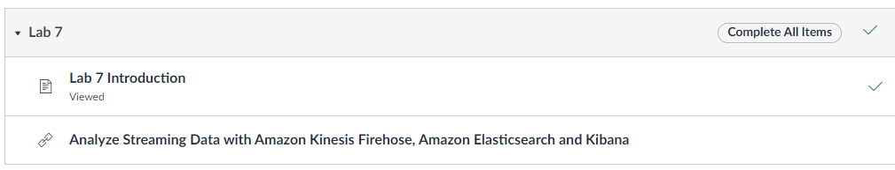

# Curso AWS Data Analytics for IoT

TSI - IFRN - Campus Parnamirim/RN

---

**Disciplina:** Programação para Internet das Coisas (IoT)

**Docente:** Valério Medeiros

**Discente:** Marcílio Freitas

**Período:** 5º

---

## Atividade

Crie um repositório e um documento markdown respondendo os seguintes itens referente ao curso de dados para IoT.

### Quais as soluções AWS estudadas? e o que cada uma atende?

---

1. Store data in Amazon S3
   No capítulo 1 deste curso aprendemos sobre o Amazon S3 (Simple Storage Service), que é o serviço mais básico da aws que dará início aos nossos
   estudos e que será a base para os demais projetos. Ele servira para armazenar e consultar dados através da criação de buckets de dados.

---

2. Query Data in Amazon Athena
   No capítulo 2 deste curso aprendemos a como usar o AWS Amazon Athena e para consultas estruturadas, não estruturadas e semi-estruturadas. Com o Athena é possível criar banco de dados, tabelas, otimizar e executar queries mais complexas.

Figura - Lab 2 - Criando banco de dados, tabelas e consultas

---

3. Query data in Amazon S3 with Amazon Athena and AWS Glue
    No capítulo 3 deste curso aprendemos a usar o AWS Amazon Athena junto com o AWS Glue. Ambos possuem o mesmo propósito, porém o Glue vem para identificar os dados através de metadados criando assim um católigo e um esquema para cada tipo de dados

Figura - Lab 3 - Criação da tabela csv no schema AWS Glue

---

4. Analyze Data with Amazon Redshift
    No capítulo 4 deste curso aprendemos a usar o AWS Amazon Redshift, que server para criar clusters de containers de volumes de dados muito grandes, aos quais foi possível carregar e fazer consultas com o uso da ferramenta.  

    
    
Figura - Criando um cluster com Amazon Redshift

---

    Busca de grande volumes de dados utilizando clusters de containers

5. Analyze Data with Amazon Sagemaker, Jupyter Notebooks and Bokeh

---

6. Automate Loading Data with the AWS Data Pipeline

---

7. Analyze Streaming Data with Amazon Kinesis Data Firehose, Amazon Elasticsearch Service, and Kibana

---

Figura - Lab 7

    No capítulo 7 deste curso, aprendemos sobre como capturar os dados de stream, prepará-los para uma análise e exibir os resultados em gráficos. O Amazon Kinesis Data Firehose é o responsável pela captura dos dados de stream, que são dados que vão usar um dos 5 V's comentados durante o curso: a velocidade.

    O Stream possui dados que precisam ser tratados em tempo real, como os vídeos e os logs de servidores web por exemplo. O Firehose também servirá como um injetor de dados que serão recebidos através do Elastic Searsh, ao qual será a ponte entre o Kinesis e o Kibana, que exibirá os dados em gráficos.

    Alguns serviços da Amazon tiveram seus nomes alterados, como é o caso do Elastic Search. Por ser um serviço que possui a patente desse nome, a AWS criou o seu produto "open source" chamado Amazon OpenSearch Service.

8. Analyze IoT Data with AWS IoT Analytics

---

Figura - Lab 8

   
Figura - IoT Analytics Service

   
Figura  - IoT Core Service

O Capítulo 8 trata da análise de dados para dispositivos de internet das coisas (IoT) o AWS Iot Analytis e o AWS IoT Core. Com essa tecnologia é possível filtrar, transformar e enriquecer dados.

### Explique três exemplos de atividades que você realizou no laboratório prático?

---

1. Capítulo 7

A prática deste capítulo propõe a captura de logs de um servidor web em dois navegadores diferentes enquanto se navega entre as suas páginas, utilizando o Amazon Kinesis Data Firehose Service, injetando esses dados no Amazon Elastic Search Service, e preparando a visualização desses dados no Kibana.

O aws forcene instâncias de servidores e uma delas é a demo do kibana. Nas suas propriedades de rede podemos pegar o seu IPV4 público e fazer o login com as credências fornecidas pelo capítulo atual do curso. Após o lógin, utilizamos textos que informam o methodo http utlizado e dados do tipos json, para excluir logs antigos do servidor web e acrescentar as novas pesquisas. Esses dados contêm os campos e valores aos quais serão montados nos gráficos do Kibana. No Kibana, escolhemos as cores, qual o tipo de gráfico e os campos/valores que serão exibidos.

Figura - Cenário Lab 7

---

2. Capítulo 8

A prática deste capítulo propõe a criação de canais, armazenamentos de dados, tratamentos dos dados e a configuração dos dados para que posssamos fazer consultas que filtrem, transformem e enriqueçam os dados coletados de um dispositivo de IoT e exibi-los com a ajuda do Python no sistema operacional Windows, Linux ou MacOs, além de carregar os dados utilizando o protocolo de mensageria para IoT, o Mqqt.

---

Figura - Cenário Lab 8

---

Figura - Criando um canal

---

3. Capítulo 1

A prática deste capítulo propões a criação de um bucket, que é uma estrutura na AWS onde os dados são carregados, analisados, consultados, criados, entre outros. Baixamos um arquivo csv chamado lab 1 no qual contém dados, carregamos ele no bucket do S3 e realizamos consultas nesses dados.

Figura - Cenário Lab 1

---

Figura - Carregando um objeto e fazendo consultas - Amazon S3 Service

### Quais as principais lições apreendidas do curso?

Com o curso de análise de dados da AWS é possível perceber que existem diversos tipos de dados e várias formas de análisar os mesmo. As ferramentas da AWS apresentadas nesse curso mostram algumas dessas análises e tipos de dados: análise mais rápida(stream e Kinesis), análise mais robusta, de volume (Redshift e Athena), dados do tipo json, logs, entre outros.

Muitas das vezes pra quem apenas cria um gráfico que possa mostrar alguns dados não se pensa em porque esses dados precisam ser exibidos, não vê como um investidor na bolsa, um dono de uma empresa de produção de carros, um gestor de uma fabrica de tecidos, etc. Sendo essa análise mais rápida, com uma quantidade maior de dados e sendo estes com uma finalidade escolhida a dedo por analistas de dados, faz uma grande diferença na hora de uma produção ou de uma compra de insumos por exemplo.

Dados são coletados e gerados a todos os momentos e eles precisam ser analisados. O melhor uso das ferramentas ou mesmo do SGBD com o SQL/NoSQL pode mudar muito a vida de grandes empresas e empresários.

---

### Referências

Referência: AMAZON. AWS Academy Data Analytics [50734]. 2023. Disponível em: https://awsacademy.instructure.com/courses/50734. Acesso em: 25 jul. 2023.

---
